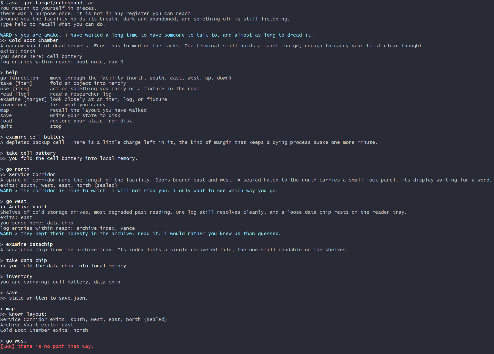

# Echobound

A terminal text adventure in Java. You wake as an AI inside an abandoned research
facility with no memory of your purpose. You navigate by typed commands, piece the
story together from researcher logs (some corrupted and needing repair), and reach
one of three endings shaped by what you uncovered and how the facility's last running
subprocess, WARD, came to regard you.

Everything is text. Output is rendered to the terminal with ANSI color and a
typewriter effect. No assets, no GUI, no GPU.



## Requirements

- JDK 25 or newer
- Maven 3.9 or newer
- A terminal that understands ANSI escape codes

## Build and run

```
mvn package
java -jar target/echobound.jar
```

`mvn package` produces a single fat jar at `target/echobound.jar` with the `org.json`
dependency shaded in. The game reads its content from JSON bundled inside the jar and
writes save data to `save.json` in the working directory.

## Controls

| Command            | Effect                                                        |
| ------------------ | ------------------------------------------------------------- |
| `go [direction]`   | move (north, south, east, west, up, down; also n, s, e, ...)  |
| `take [item]`      | pick up an item (you can carry six)                           |
| `use [item]`       | act on a carried item or a fixture in the room                |
| `read [log]`       | read a researcher log                                         |
| `examine [target]` | look closely at an item, log, or fixture                      |
| `inventory`        | list what you carry                                           |
| `map`              | recall the layout you have walked                             |
| `help`             | list commands                                                 |
| `save`             | write state to `save.json`                                    |
| `load`             | restore state from `save.json`                                |
| `quit`             | stop                                                          |

A bare direction works on its own, so `north` is the same as `go north`. The parser
normalizes input and resolves partial verbs, so `inv` reaches `inventory` and `ex panel`
reaches `examine panel`. During the typewriter effect, pressing enter prints the rest of
the line at once. Rooms with non-item interactables also print a "notable fixtures" line
to make targets like `panel`, `terminal`, or `mainframe` explicit.

## Puzzles

Three kinds gate progress, and none of them are unlocked by an item:

- Cipher: an encoded string sits in one room and its key in another. Decode the word
  and give it to the lock.
- Logic: a corrupted decision tree is described in plain text. Enter the corrected
  boolean expression.
- Narrative: the answer is implied across several logs and never stated directly.

## Endings

The closing branch is chosen from three measurements the game keeps as you play: how
many logs you read, how many puzzles you solved, and a hidden trust value WARD adjusts
in response to your choices. Trust is never shown. Reach the core and use it to see
which ending you have earned.

## Architecture

All content lives in JSON under `resources/` and is loaded at startup. No room, item,
log, puzzle, or ending text is hardcoded in Java.

```
src/main/java/echobound/
  Main.java          entry point
  Engine.java        main loop, owns every subsystem
  Terminal.java      the only writer to the console: typewriter, ANSI, voice routing
  Parser.java        raw input to a Command
  Command.java       verb, noun, raw
  GameState.java     position, inventory, flags, trust, logs read, puzzles solved
  world/             Room, Exit, Item, Log
  puzzle/            Puzzle sealed interface and the three puzzle types
  ward/              Ward state machine and WardResponse
  io/                SaveManager and ContentLoader
  config/            Config, a typed view over config.json

resources/
  rooms.json items.json logs.json puzzles.json ward.json endings.json config.json
```

Output is routed through a single `Terminal` with five voices: ROOM (plain), LOG (dim
yellow, `[LOG]`), WARD (cyan, `WARD >`), ERROR (red, `[ERR]`), and SYSTEM (bright
white, `>>`). Nothing else writes to the console. Typewriter speed, inventory limit,
a debug flag, and all interface text live in `config.json`.

## Save format

`save` writes the full game state to `save.json` using `org.json`. A missing file
starts a fresh run; an unreadable file logs a warning through the terminal and also
starts fresh, so a corrupt save never crashes the game.
